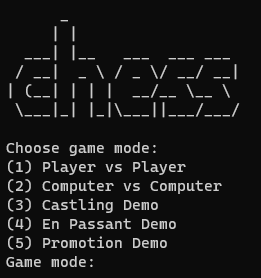
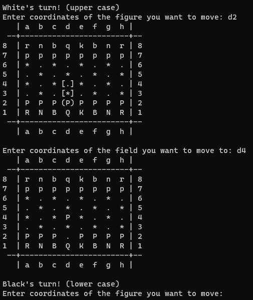

# Chess
## Description
A simple console chess game written in C++ using OOP principles. It supports classic chess rules and you can choose from different game modes and board sizes.

## How to build
```shell
mkdir build
cd build
cmake ../src
```

## How to play
You can choose from different game modes:



With the Player vs Player mode you can play against another player on the same computer. The Computer vs Computer mode is a simulation of a game between two players based on random moves to demonstrate a possible game. Some Demos are also included to demonstrate more complex situations.

After choosing a game mode you can also choose from different board sizes >= 8.

When choosing PvP mode you can enter your move like this: 

